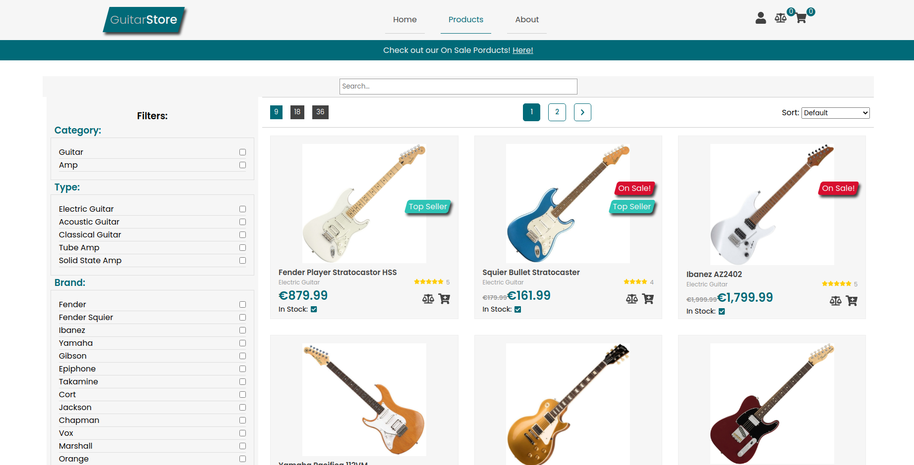

# Mock Guitar Store E-Commerce website

[Live Demo](https://guitar-store-site.netlify.app/).

### The backend is hosted on render.com

> Render spins down a Free web service that goes 15 minutes without receiving inbound traffic. Render spins the service back up whenever it next receives a request to process.

> Spinning up a service takes a few seconds, which causes a noticeable delay for incoming requests until the service is back up and running. For example, a browser page load will hang momentarily.

## Intro

Complete frontend for a Guitar E-Commerce website. I also created the backend API to store the products.

## Description

Fully working frontend for an E-commerce website. Products are paginated and can be filtered, sorted and searched. You can compare different products and also add items to your cart. Created a mock Rest API for storing product data. [Guitar Store API](https://github.com/VWRoli/guitar-store-api).

## Technologies & Tools

### Front-end:

- React
- Redux
- React Router
- Sass

### Backend:

- [JSON Server](https://github.com/typicode/json-server) for creating the REST API
